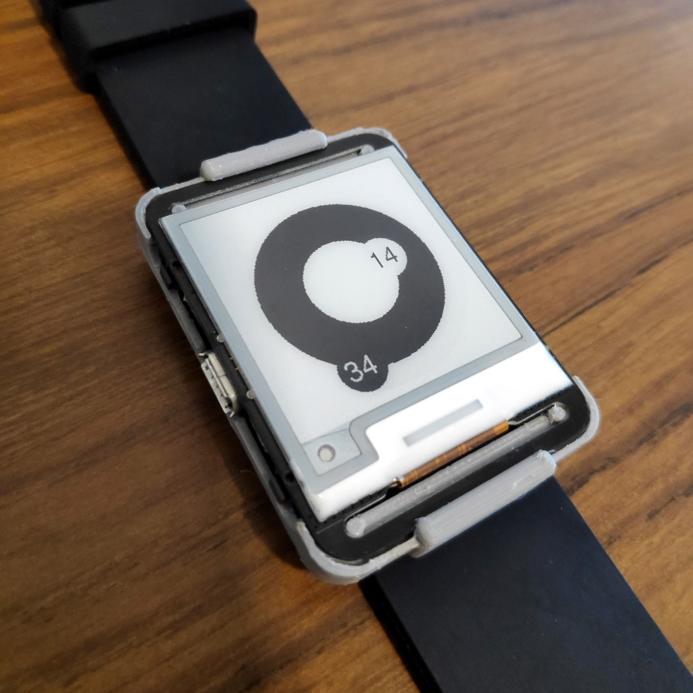

# Case design for the Watchy open source watch

## Note
This case design is now obsolete, the concept didn't hold and I moved to a different design direction.  
The latest viable design is the ["Suited"](https://github.com/giladaya/watchy-case-suited)
This repo is left here for reference.

## Original description
Designed using [CadQuery](https://github.com/CadQuery/cadquery) by Gilad Dayagi.

Includes a case body and 2 copies of a fastener.  
Use a screw to attach the fastener to the body.  
Designed for use with 24mm straps.
Adjust the parameters at the top for your needs.  

See photos folder for more photos.
